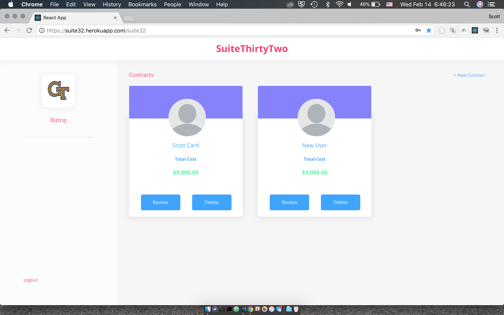

# sweetthirtytwo

 
======================================================

Final Project during the Georgia Tech Coding Bootcamp. 

-- Suite32, was built as an administrative application for a Denistry office. -- 

All new employees will have to sign up and they can use that to login in the future. Once that is completed, they have a dashboard that displays all the current contracts under their supervision.  When a client comes in, the administrator will enter the clients payment and insurance information and then that information will be displayed on a contract "card" which is displayed in the dashboard to be viewed and/or updated later. 

